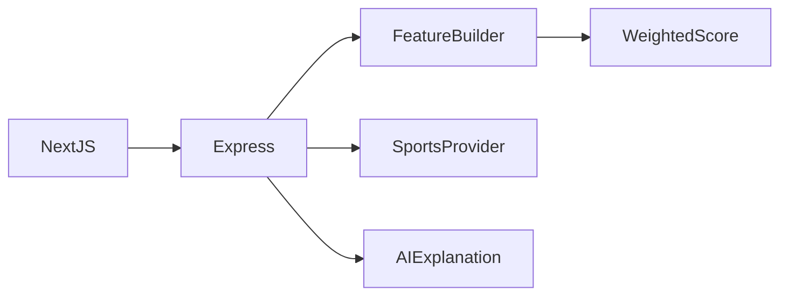

# مساعد تحليل كرة القدم

**بيانات رياضية وتفسيرات بالذكاء الاصطناعي**

[English](README.md)

تحويل بيانات الفرق والدوريات إلى تحليل مفهوم للمباريات مع بيان نقص البيانات وحدود المزود.

**التقنيات:** TypeScript · Express · Next.js · API-Football · Grok

## الحالة والتاريخ

تطبيق بيانات كرة قدم وتحليل بالذكاء الاصطناعي. التقدير الاستدلالي ليس نموذج توقع مُثبتاً.

هذه نسخة عرض منقحة للنشر. تعرض [وثيقة التحقق](docs/verification.ar.md) الفحوص الحالية بصورة مستقلة عن النشر السابق.

## الوظائف والإجراءات

- استخراج الفرق وتحديد الدوري المدعوم
- ترتيب مع رجوع إلى موسم بديل
- إعادة محاولة المزود وتخزين في الذاكرة
- بناء خصائص ونتيجة موزونة واكتمال بيانات
- مطالبات منظمة وتحليل مخرجات الذكاء الاصطناعي
- فحص وحدود طلبات Express وواجهة Next.js

سؤال عن ترتيب أو مباراة ← تحديد الفرق والدوري ← تجميع بيانات المزود ← حساب الخصائص والنتيجة الاستدلالية ← تفسير الذكاء الاصطناعي للأدلة ← بيان استخدام المزود.

## البنية

## القرارات الهندسية

- تُحمّل البيئة داخل وحدة الإعداد قبل فحصها وليس بعد استيرادها.
- يجب تطبيق حدود الطلبات على /chat و/leagues الفعليين؛ بادئة /api/ القديمة لا تحميهما.
- اكتمال البيانات والموسم البديل جزء من الرد. وقت الرد ليس عمر بيانات المزود.
- يشرح نص الذكاء الاصطناعي الأدلة المنظمة ولا يثبت دقة توقع أو معايرة رهان.

## المجلدات

| المكون | المسؤولية |
|---|---|
| `backend/src/providers/` | عملاء بيانات الرياضة وتفسير الذكاء الاصطناعي |
| `backend/src/prediction/` | بناء الخصائص والحساب الترجيحي |
| `backend/src/routes/` | مسارات الدردشة والدوريات والصحة |
| `backend/tests/` | فحوص المسارات والحساب الموجودة |
| `frontend/` | واجهة Next.js |

## التثبيت والإعداد

استخدم Node 20 أو أحدث. ثبّت backend وfrontend كلّاً على حدة. بيئة الخادم في backend/.env وبيئة الواجهة في frontend/.env.local. شغّل npm run dev في كل مكون. استخدم العينات للعرض والفحص؛ بيانات المزود الحقيقي مطلوبة عند تعطيل وضع العينات. أوامر الأنواع والاختبارات والبناء في الخادم.

توجد أوامر التشغيل ومتغيرات البيئة في [دليل الإعداد](docs/setup.ar.md). القيم أمثلة محلية أو حقول فارغة؛ لا تعِد استخدام بيانات إنتاج سابقة.

## العرض والتحقق

سؤال عن ترتيب أو مباراة ← تحديد الفرق والدوري ← تجميع بيانات المزود ← حساب الخصائص والنتيجة الاستدلالية ← تفسير الذكاء الاصطناعي للأدلة ← بيان استخدام المزود.

استخدم حسابات وسجلات اصطناعية. راجع [خطوات العرض](docs/demo.ar.md) وسجل نتائج الفحوص الحالية. نجاح بناء مكون لا يثبت نجاح كل مسارات المنتج.

## الحدود

الدرجة الترجيحية تقريبية وغير معايرة؛ لا ندعي دقة تاريخية أو نتيجة رهان آمنة. لم نستخدم نداءات مزود مدفوعة. تبقى نتائج تدقيق اعتماديات أدوات البناء؛ راجع ملاحظة التدقيق.

## التوثيق

- [البنية](docs/architecture.ar.md)
- [الإعداد](docs/setup.ar.md)
- [العرض](docs/demo.ar.md)
- [المسارات](docs/api.ar.md)
- [الفحوص الحالية](docs/verification.ar.md)
- [النشر وحل المشكلات](docs/deployment.ar.md)
- [حقوق الأصول](THIRD_PARTY_NOTICES.md)

## المساهمة والترخيص

افتح مشكلة تتضمن خطوات إعادة الإنتاج والمكون المعني. استخدم بيانات اصطناعية وتعديلات مركزة وفحوصاً مناسبة، ولا ترسل أسراراً أو سجلات مستخدمين خاصة. الشيفرة بترخيص [MIT](LICENSE)، وتحتفظ الاعتماديات والأصول الخارجية بشروطها الأصلية.

<!-- release-presentation -->

## من التطبيق الفعلي

هذه لقطة فعلية للواجهة المحلية، وليست دليلاً على استخدام إنتاجي أو فحص أندرويد.

## التحقق والقراءة المتعمقة

نجحت اختبارات الخادم الـ21 وفحص TypeScript وبناء الواجهة الإنتاجي. أعاد تحليل المتصفح بيانات مولدة ووضح عدم الاتصال بأي مزود. حُدّث Next.js إلى 15.5.27 لمعالجة تنبيهات أمنية مؤكدة؛ تُسجل نتائج تدقيق الاعتماديات المتبقية منفصلة.

الدرجة الترجيحية تقريبية وغير معايرة؛ لا ندعي دقة تاريخية أو نتيجة رهان آمنة. لم نستخدم نداءات مزود مدفوعة. تبقى نتائج تدقيق اعتماديات أدوات البناء؛ راجع ملاحظة التدقيق.

- [دراسة المشروع](docs/case-study.ar.md)
- [التحقق](docs/verification.ar.md)
- [مخطط البنية](docs/architecture.svg)
- [صفحة المشروع](https://mohamed-abderrehmane-portfolio.hillock-factual9mupt.chatgpt.site/ar/projects/football-prediction-assistant/)

- [تفاصيل هندسية ودروس التنفيذ](docs/engineering-notes.ar.md)
