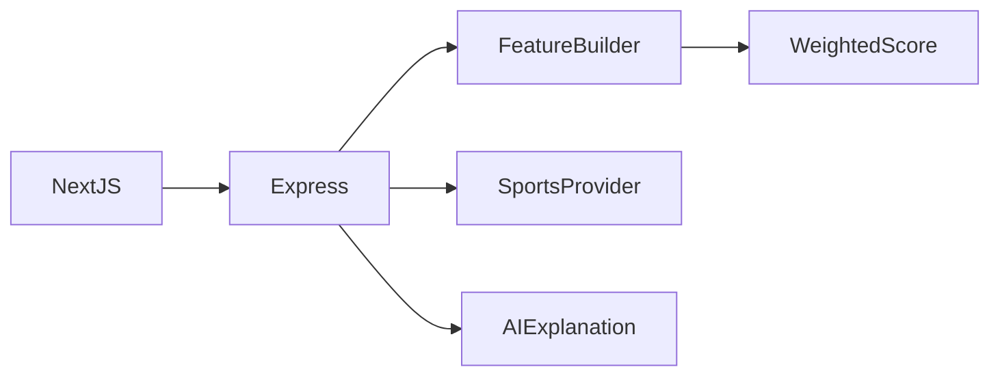
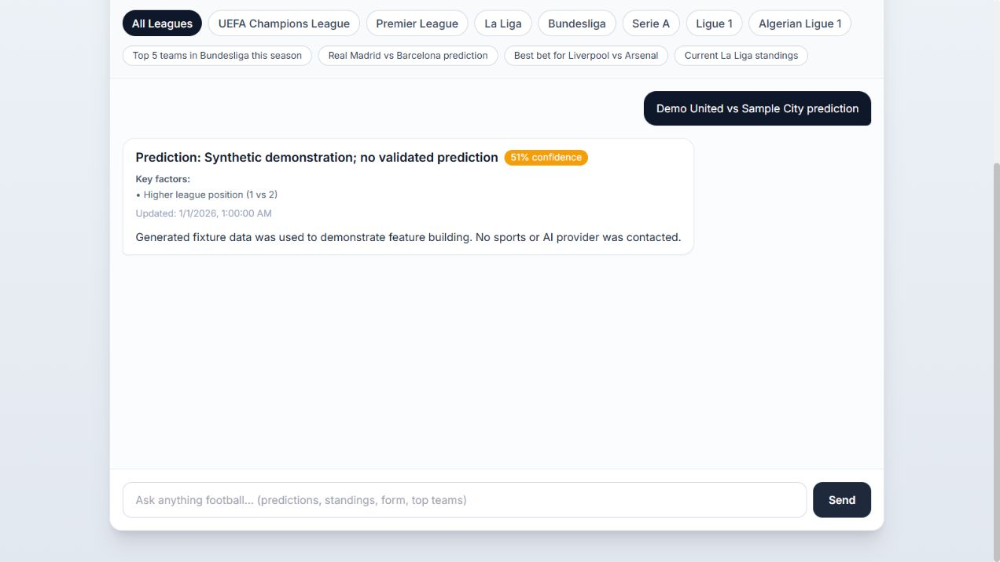

# Football Prediction Assistant

**Sports data and AI explanations**

[العربية](README.ar.md)

Transform structured team and league data into understandable match analysis while exposing missing-data and provider limits.

**Technology:** TypeScript · Express · Next.js · API-Football · Grok

## Status and deployment history

Football data and AI analysis application. A heuristic estimate is not a validated predictive model.

This is a sanitized portfolio release. See the current [verification record](docs/verification.md) before choosing a runtime demonstration.

## Main workflows and implemented features

- Team extraction and supported-league lookup
- Standings with season fallback
- Provider retry and in-memory caching
- Feature building, weighted score and data completeness
- Structured prompts and AI output parsing
- Express validation/rate limiting and Next.js interface

User asks about standings or a match → teams/league are resolved → provider data is assembled → features and heuristic score are calculated → AI explains the supplied evidence → response reports provider usage.

## Architecture

## Engineering decisions

- Environment loading belongs in the configuration module before validation, not after importing it.
- Rate limiting must cover the mounted `/chat` and `/leagues` paths; the previous `/api/` prefix did not protect them.
- Data completeness and season fallback are part of the response story. A response timestamp is not the age of its provider data.
- AI prose explains structured evidence; it does not establish calibrated betting or prediction accuracy.

## Directory guide

| Component | Responsibility |
|---|---|
| `backend/src/providers/` | Sports and AI provider clients |
| `backend/src/prediction/` | Features and scoring |
| `backend/src/routes/` | Chat, leagues and health |
| `backend/tests/` | Existing route/scoring checks |
| `frontend/` | Next.js interface |

## Installation

Use Node 20+ and npm. Install independently in `backend/` and `frontend/`. Backend environment lives in `backend/.env`; frontend public API URL lives in `frontend/.env.local`. Run `npm run dev` in each component. Use fixture mode for demonstration and checks; real provider credentials are optional only when fixture mode is enabled. Run backend `npm run typecheck`, `npm test -- --run` and `npm run build`.

All required/private configuration is described in [setup](docs/setup.md). Examples contain placeholders or local demo values. Never reuse historical credentials.

## Demonstration

- Start with deterministic fixtures and no paid provider keys.
- Ask for a supported league table and a synthetic match analysis.
- Submit invalid/missing team input and inspect rejection.
- Exercise provider errors, malformed AI output and fallback metadata in checks.

## Verification and limitations

- Type checking and existing Vitest checks
- Fixture standings and match analysis
- Actual-route rate limiting
- Fallback/provider metadata and output parser

No historical accuracy percentage. Live season access depends on provider plan. Redis URL is declared historically, but the shown clients use process-local Maps; do not claim Redis caching is integrated.

## Documentation

- [Architecture](docs/architecture.md) · [العربية](docs/architecture.ar.md)
- [Setup and configuration](docs/setup.md) · [العربية](docs/setup.ar.md)
- [Demo walkthrough](docs/demo.md) · [العربية](docs/demo.ar.md)
- [API and execution paths](docs/api.md)
- [Verification record](docs/verification.md)
- [Deployment and troubleshooting](docs/deployment.md)
- [Asset attribution](THIRD_PARTY_NOTICES.md) · [MIT license](LICENSE)

## Contributing

Open an issue describing a reproducible problem, expected behavior and component involved. Use synthetic data. Keep changes focused and include relevant checks. Do not include credentials or private user records.

## License and attribution

Source code is MIT licensed. Third-party dependencies and assets retain their own terms; see [attribution](THIRD_PARTY_NOTICES.md).

<!-- release-presentation -->

## Actual application interface

Captured from the local application with synthetic records. This does not establish production usage or Android device verification.

## Verification and deeper reading

All 21 backend tests, TypeScript checking and frontend production build passed. Browser fixture analysis returned generated data and explicitly stated that no provider was contacted. Next.js was updated to 15.5.27 for confirmed security advisories; remaining dependency audit findings are recorded separately.

The weighted score is heuristic and uncalibrated; no historical prediction accuracy or safe betting outcome is asserted. Paid provider calls were not used. Build-tool dependency audit findings remain; see the audit note.

- [Case study](docs/case-study.md)
- [Verification](docs/verification.md)
- [Architecture diagram](docs/architecture.svg)
- [Portfolio case study](https://mohamedabderrehmane.netlify.app/projects/football-prediction-assistant/)

- [Engineering details and implementation lessons](docs/engineering-notes.md)
