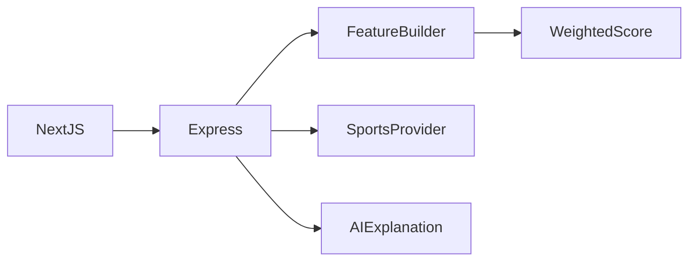

# بنية مساعد تحليل كرة القدم

سؤال عن ترتيب أو مباراة ← تحديد الفرق والدوري ← تجميع بيانات المزود ← حساب الخصائص والنتيجة الاستدلالية ← تفسير الذكاء الاصطناعي للأدلة ← بيان استخدام المزود.

## القرارات والمفاضلات

- تُحمّل البيئة داخل وحدة الإعداد قبل فحصها وليس بعد استيرادها.
- يجب تطبيق حدود الطلبات على /chat و/leagues الفعليين؛ بادئة /api/ القديمة لا تحميهما.
- اكتمال البيانات والموسم البديل جزء من الرد. وقت الرد ليس عمر بيانات المزود.
- يشرح نص الذكاء الاصطناعي الأدلة المنظمة ولا يثبت دقة توقع أو معايرة رهان.

## مراجع الشيفرة

- [backend/src/config/env.ts](../backend/src/config/env.ts)
- [backend/src/server.ts](../backend/src/server.ts)
- [backend/src/routes/chat.ts](../backend/src/routes/chat.ts)
- [backend/src/prediction/featureBuilder.ts](../backend/src/prediction/featureBuilder.ts)
- [backend/src/providers/apiFootball/client.ts](../backend/src/providers/apiFootball/client.ts)

## الحدود

لا توجد نسبة دقة تاريخية موثقة. يعتمد الوصول للمواسم على خطة المزود. تستخدم العملاء Map محلية؛ وجود REDIS_URL لا يثبت تكامل Redis.
