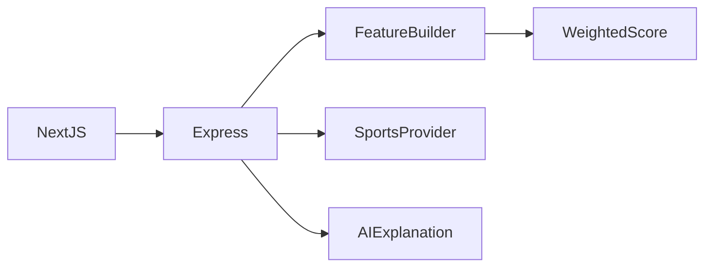

# Football Prediction Assistant architecture

User asks about standings or a match → teams/league are resolved → provider data is assembled → features and heuristic score are calculated → AI explains the supplied evidence → response reports provider usage.

## Decisions and tradeoffs

- Environment loading belongs in the configuration module before validation, not after importing it.
- Rate limiting must cover the mounted `/chat` and `/leagues` paths; the previous `/api/` prefix did not protect them.
- Data completeness and season fallback are part of the response story. A response timestamp is not the age of its provider data.
- AI prose explains structured evidence; it does not establish calibrated betting or prediction accuracy.

## Component boundaries

| Component | Responsibility |
|---|---|
| `backend/src/providers/` | Sports and AI provider clients |
| `backend/src/prediction/` | Features and scoring |
| `backend/src/routes/` | Chat, leagues and health |
| `backend/tests/` | Existing route/scoring checks |
| `frontend/` | Next.js interface |

## Source evidence

- [backend/src/config/env.ts](../backend/src/config/env.ts)
- [backend/src/server.ts](../backend/src/server.ts)
- [backend/src/routes/chat.ts](../backend/src/routes/chat.ts)
- [backend/src/prediction/featureBuilder.ts](../backend/src/prediction/featureBuilder.ts)
- [backend/src/providers/apiFootball/client.ts](../backend/src/providers/apiFootball/client.ts)

## Limits

No historical accuracy percentage. Live season access depends on provider plan. Redis URL is declared historically, but the shown clients use process-local Maps; do not claim Redis caching is integrated.
